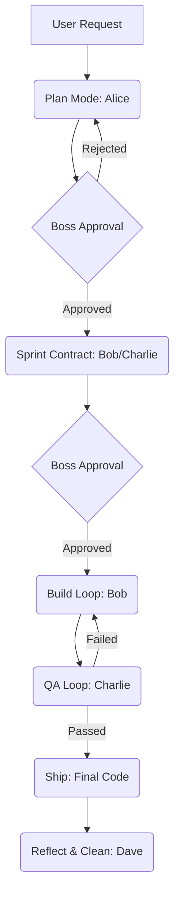

# 🏢 Agent's Office: Agent-First Virtual IT Team Simulator


**Agent's Office** is an innovative, fully autonomous virtual IT team simulation platform built on the "Agent-First" engineering philosophy. By leveraging the power of Google's Gemini 3.1 Pro and Flash Lite models, this application orchestrates a multi-agent system where specialized AI agents collaborate to plan, build, test, and refine software projects—all without direct human coding intervention.

---

## 🌟 Key Features

- **🤖 Multi-Agent Orchestration**: A specialized team of AI agents (Planner, Generator, Evaluator, Gardener) working in tandem.
- **🔄 Harness Engineering Pipeline**: Implements a strict 6-step workflow (Plan Mode ➔ Sprint Contract ➔ Build Loop ➔ QA Loop ➔ Ship ➔ Reflect & Clean).
- **🎨 Retro Pixel Art UI**: A nostalgic, gamified interface inspired by classic simulation games (e.g., Princess Maker 2), complete with animated office environments.
- **⚙️ Per-Agent Configuration**: Toggle agents ON/OFF, assign specific LLM models (e.g., `gemini-3.1-pro-preview` vs `gemini-3.1-flash-lite-preview`), and edit their core `rules.md` directives in real-time.
- **📦 One-Click Artifact Export**: Download all generated requirements, sprint contracts, and final HTML/CSS code as a single `.zip` archive.
- **📱 Responsive Design**: Fully optimized for desktop, tablet, and mobile environments with independent scrolling areas.

---

## 🏗️ Architecture & Workflow

The system strictly adheres to the `Types → Config → Repo → Service → Runtime → UI` architectural pattern, ensuring separation of concerns and high maintainability.

### 🧩 Multi-Agent Roles

| Agent | Role | Description |
| :--- | :--- | :--- |
| **Alice** | `Planner (CEO)` | Translates 1-4 line user requests into detailed product requirement documents (PRD). Focuses on business value and high-level technical design. |
| **Bob** | `Generator (Engineer)` | Writes the actual code based on the PRD. Prefers building internal utilities over external libraries for better agent readability. |
| **Charlie** | `Evaluator (QA)` | Acts as an independent, skeptical QA tester. Verifies the generated UI and logic, sending detailed feedback back to the Generator until tests pass. |
| **Dave** | `Gardener (Manager)` | Performs background garbage collection, refactoring bad code patterns (AI slop), and keeping documentation up-to-date. |

### 🔄 The 6-Step Agentic Pipeline



1. **Plan Mode**: Planner analyzes user intent and drafts a detailed PRD.
2. **Sprint Contract**: Before coding, Generator and Evaluator agree on the "Definition of Done".
3. **Build Loop**: Generator writes agent-readable code.
4. **QA Loop**: Evaluator tests the output and provides feedback.
5. **Ship**: The final, verified code is ready for deployment.
6. **Reflect & Clean**: Gardener cleans up technical debt and updates docs.

---

## 🚀 Getting Started

### Prerequisites

- Node.js (v18 or higher)
- npm or yarn
- Google Gemini API Key

### Installation

1. Clone the repository:
   ```bash
   git clone https://github.com/yourusername/agents-office.git
   cd agents-office
   ```

2. Install dependencies:
   ```bash
   npm install
   ```

3. Configure Environment Variables:
   Create a `.env` file in the root directory and add your Gemini API Key:
   ```env
   VITE_GEMINI_API_KEY=your_api_key_here
   ```

4. Start the development server:
   ```bash
   npm run dev
   ```

5. Open your browser and navigate to `http://localhost:3000`.

---

## 🛠️ Tech Stack

- **Frontend Framework**: React 18 with TypeScript
- **Styling**: Tailwind CSS (Utility-first, responsive design)
- **Animations**: Motion (Framer Motion)
- **Icons**: Lucide React
- **AI Integration**: `@google/genai` (Gemini 3.1 Pro & Flash Lite)
- **Markdown Rendering**: `react-markdown`
- **File Archiving**: `jszip`
- **Build Tool**: Vite

---

## 📁 Project Structure

```text
agents-office/
├── src/
│   ├── components/       # UI Components (Office, ChatLog, Preview, etc.)
│   ├── services/         # API and Business Logic (geminiService.ts)
│   ├── types.ts          # Global TypeScript Interfaces
│   ├── App.tsx           # Main Application Entry & State Management
│   ├── main.tsx          # React DOM Render
│   └── index.css         # Global Styles & Tailwind Directives
├── public/               # Static Assets
├── AGENTS.md             # Core Agent Directives & Map
├── package.json          # Dependencies & Scripts
└── vite.config.ts        # Vite Configuration
```

---

## 🤝 Contributing

We welcome contributions! Please follow the "Agent-First" philosophy outlined in `AGENTS.md`. 

1. Fork the Project
2. Create your Feature Branch (`git checkout -b feature/AmazingFeature`)
3. Commit your Changes (`git commit -m 'Add some AmazingFeature'`)
4. Push to the Branch (`git push origin feature/AmazingFeature`)
5. Open a Pull Request

---

## 📜 License

Distributed under the MIT License. See `LICENSE` for more information.

---

*“조사 없이는 수정 없다.” - Agent's Office Core Principle*
